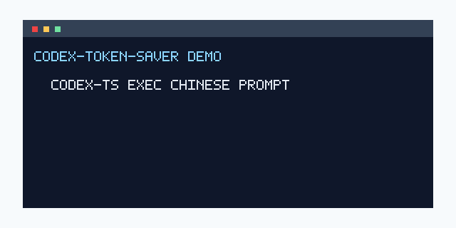

# Codex Token Saver

[](https://github.com/lyymuwu/codex-token-saver/actions/workflows/ci.yml)
[](LICENSE)
[](https://github.com/openai/codex)
[](#safe-uninstall)


Codex Token Saver is a drop-in safe wrapper for Codex CLI. It accepts prompts in any language, translates the natural-language instruction into English before the expensive Codex run, and translates the final `codex exec` answer back to the original language.

The official `codex` binary stays untouched and updateable. You run `codex-ts` when you want token-saving translation, and keep `codex` exactly as it is.

```bash
curl -fsSL https://raw.githubusercontent.com/lyymuwu/codex-token-saver/main/scripts/bootstrap.sh | bash
```



## Why It Exists

Many tokenizers spend more tokens on Chinese, Japanese, Thai, Hindi, Arabic, and other non-English prompts than on equivalent English prompts. Codex Token Saver tries to move the expensive part of the workflow into English while preserving the user experience in your own language.

It is not magic: hidden reasoning tokens remain invisible to the wrapper, and real savings depend on the model, tokenizer, task length, and how much code/log content is already language-neutral. But for long natural-language prompts, it can reduce the main Codex prompt size while using a cheaper translation path.

## Highlights

- **Any-language input**: Chinese, Japanese, Korean, Thai, Hindi, Arabic, Russian, Spanish, French, German, and more.
- **Same-language output**: final `codex exec` answers are translated back to the detected source language.
- **Code-safe translation**: code blocks, inline code, paths, commands, JSON/YAML/TOML, stack traces, tables, URLs, and quoted literals are preserved.
- **No Codex patching**: `codex-ts` is a wrapper, not a replacement for `/opt/homebrew/bin/codex` or the official package.
- **Uses your Codex login by default**: translation runs through `codex exec -m gpt-5.4-mini`, so no separate API key is required.
- **OpenAI-compatible mode**: switch to `provider = "openai"` for `gpt-5-nano`, `gpt-4.1-nano`, `gpt-4o-mini`, or another compatible endpoint.
- **Safe install and uninstall**: every managed path is recorded in an install manifest and removed conservatively.
- **Benchmark included**: see [docs/benchmark.md](docs/benchmark.md) for visible-token estimates across languages.

## Quick Start

Fast path:

```bash
curl -fsSL https://raw.githubusercontent.com/lyymuwu/codex-token-saver/main/scripts/bootstrap.sh | bash
source ~/.zshrc
codex-ts doctor
```

Safer inspect-first path:

```bash
git clone https://github.com/lyymuwu/codex-token-saver.git
cd codex-token-saver
./scripts/install.sh
source ~/.zshrc
codex-ts doctor
```

The installer creates a managed shim at `~/.local/bin/codex-ts` and a config file at `~/.codex-token-saver/config.toml`.

If you want `codex` itself to mean `codex-ts`, opt in explicitly:

```bash
./scripts/install.sh --alias
```

For the one-line installer with alias:

```bash
curl -fsSL https://raw.githubusercontent.com/lyymuwu/codex-token-saver/main/scripts/bootstrap.sh | bash -s -- --alias
```

## Examples

```bash
codex-ts exec "请帮我检查这个仓库为什么测试失败"
codex-ts exec "Por favor revisa por que fallan las pruebas"
codex-ts exec "このプロジェクトのREADMEをもっと魅力的にして"
echo "请总结这个错误日志" | codex-ts exec -
codex-ts "请帮我修改这个项目的 README"
```

Pass-through commands keep the original Codex behavior:

```bash
codex-ts --version
codex-ts --help
codex-ts login
codex-ts marketplace
```

## How It Works

```text
your prompt in any language
        |
        v
language detection + protected-region preservation
        |
        v
cheap translation model -> English prompt
        |
        v
real Codex CLI
        |
        v
final answer -> original language
```

Detection is intentionally conservative. Non-Latin scripts are detected locally with Unicode script ratios. Latin-script languages such as Spanish or French can be confirmed with the configured cheap model when the heuristic is uncertain. Code-heavy prompts pass through unchanged.

## Configuration

Default config:

```toml
enabled = true
provider = "codex_cli"
model = "gpt-5-nano"
codex_model = "gpt-5.4-mini"
base_url = "https://api.openai.com/v1"
api_key_env = "OPENAI_API_KEY"
source_language = "auto"
target_language = "English"
min_non_english_ratio = 0.25
mode = "auto"
detect_latin_languages = true
translate_final_only = true
fallback_on_error = "passthrough"
show_savings_report = true
timeout_seconds = 45
debug_save_text = false
```

`provider = "codex_cli"` reuses your Codex account and quota. `codex_model = "gpt-5.4-mini"` is the default because ChatGPT-account Codex CLI currently supports it for cheap translation calls.

To use a separate OpenAI-compatible API:

```toml
provider = "openai"
model = "gpt-5-nano"
base_url = "https://api.openai.com/v1"
api_key_env = "OPENAI_API_KEY"
```

Then set the key in your shell:

```bash
export OPENAI_API_KEY="..."
```

To force a known source language and skip auto-detection:

```toml
source_language = "Spanish"
```

## Verifying Savings

Run a visible dry check:

```bash
codex-ts doctor
```

For `codex exec`, the wrapper prints an estimate like:

```text
codex-ts: estimated prompt tokens 120 -> 78 (-42); language=Chinese; elapsed=12.4s
```

This estimate only covers the visible prompt. It cannot measure hidden reasoning tokens or the exact backend billing tokenizer. The best practical verification is to compare the prompt that the real Codex process receives in a fake-Codex integration test, which this repo includes.

```bash
python3 -m unittest discover -s tests
```

See the full benchmark page: [docs/benchmark.md](docs/benchmark.md).

Snapshot:

| Language | Original visible tokens | English visible tokens | Estimated saving |
|---|---:|---:|---:|
| Chinese | 35 | 24 | 31.4% |
| Japanese | 49 | 24 | 51.0% |
| Thai | 89 | 24 | 73.0% |
| Hindi | 93 | 24 | 74.2% |
| Arabic | 70 | 24 | 65.7% |

## Safe Uninstall

Preview first:

```bash
~/.codex-token-saver/scripts/uninstall.sh --dry-run
```

Remove managed files:

```bash
~/.codex-token-saver/scripts/uninstall.sh
```

Normal uninstall removes only files and shims listed in `~/.codex-token-saver/install-manifest.json`. It preserves your config and logs.

Remove the plugin home too:

```bash
~/.codex-token-saver/scripts/uninstall.sh --purge --yes
```

The uninstaller refuses to delete unmanaged files and refuses paths outside the plugin home, the managed `codex-ts` shim, or the marked shell rc block.

## Privacy And Safety

Prompts that need translation are sent to the configured translation provider before the main Codex run sees them. With the default `codex_cli` provider, that means a separate cheap-model Codex call. Final answers from `codex exec` are also sent to the translation provider for back-translation.

Logs redact secrets and store operational metadata only by default: token estimates, language labels, model name, timing, and errors. Set `debug_save_text = true` only if you explicitly want text saved for debugging.

## Limitations

- `codex exec` is the reliable path because Codex exposes `--output-last-message`.
- Interactive TUI mode translates the initial prompt, but perfect final-only stream translation requires stable Codex hooks.
- Translation adds latency and may cost extra cheap-model quota.
- If translation, detection, quota, or network calls fail, the wrapper warns and falls back to raw Codex.
- Token savings are heuristic; actual billing depends on Codex internals.

## Roadmap

- [ ] Homebrew install.
- [ ] Tokenizer-specific benchmark reports.
- [ ] Translation cache for repeated prompts.
- [ ] Better interactive TUI final-answer handling.
- [ ] Release benchmark snapshots.
- [ ] Explore wrappers for other AI coding CLIs.

## FAQ

**Does this replace Codex?**  
No. `codex-ts` finds and runs the real `codex` binary. The official Codex CLI remains untouched.

**Does this guarantee lower bills?**  
No. It can reduce visible prompt tokens for many non-English prompts, but hidden reasoning tokens and backend billing details are outside the wrapper.

**Is `curl | bash` safe?**  
It is convenient, not magic. The recommended security path is to clone the repo, inspect `scripts/install.sh`, and then run it locally.

## Development

```bash
python3 -m unittest discover -s tests
shellcheck scripts/*.sh scripts/codex-ts
python3 scripts/benchmark_visible_tokens.py
```

Release artifacts should include repository files only. Never bundle local config, logs, tokens, `.env` files, or `install-manifest.json`.

## License

MIT
